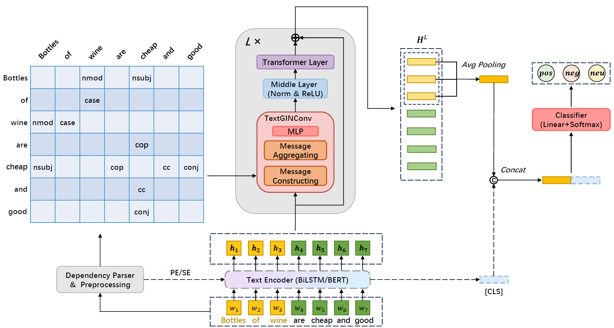

<!--
<style>
img{
    width:80%;
    padding-left: 10%;
}
</style>
-->

# TextGT: A Double-View Graph Transformer on Text for Aspect-Based Sentiment Analysis

We introduce graph Transformer into text representation learning and apply it to the ABSA task. To tightly combine the 2 text learning processes in graph view and sequence view, we propose a novel double-view **g**raph **T**ransformer for **text** called **TextGT**. The overview of TextGT is as follows:<br/><br/> <br/>


Additionally, we propose a new algorithm to implement graph convolutional modules which densely pass messages constructed with edge features, and one of such modules called **TextGINConv** is specifically employed as the graph-view operator in our TextGT. (We also implement TextGCNConv and TextGATConv, for simplicity we call the framework **TextGraphConv**)


TextGT is built using [PyTorch](https://pytorch.org/) as well as [transformers](https://huggingface.co/docs/transformers/index), and TextGraphConv is based on sparse message passing graph convolutional modules from [PyG](https://www.pyg.org/). Specifically *Pytorch v1.12.1* and *transformers v4.26.1* are required, and package requirements are concluded in `requirements.txt`. Hardware used is 2 NVIDIA GeForce RTX 3090 GPUs.

```bash

# Python environment setup
conda create -n text_gt python=3.9
conda activate text_gt
pip install -r requirements.txt
```


### Priliminaries

Due to the size limit of the sumpplementary material, the datasets and the GloVe file are not included here in this directory.

The datasets can be downloaded from github repository of the baseline [SSEGCN](https://github.com/zhangzheng1997/SSEGCN-ABSA), [DualGCN](https://github.com/CCChenhao997/DualGCN-ABSA) or [CDT](https://github.com/Guangzidetiaoyue/CDT_ABSA). Datasets contained there have been already preprocessed by CoreNLP. If the users want to preprocess from scratch, then please refer to [Stanford CoreNLP](https://stanfordnlp.github.io/CoreNLP/simple.html) to download the util package named like `stanford-corenlp-full-***` and put it under this directory, and in Python start with `from stanfordcorenlp import StanfordCoreNLP` and `nlp = StanfordCoreNLP(r'./stanford-corenlp-full-***')` to use it.

After downloading the datasets, to run TextGT w/o BERT, please download and unzip the GloVe file (`glove.840B.300d.zip`) from [https://nlp.stanford.edu/projects/glove/](https://nlp.stanford.edu/projects/glove/) and put it under `./glove`. Then use commands like `python ./prepare_vocab.py --data_dir ./dataset/Restaurants_corenlp --vocab_dir ./dataset/Restaurants_corenlp` to prepare the vocab for each dataset. As for the BERT version, the pre-trained model will be downloaded automatically while running.


**The log files of some experimental runs are under directory `./logs`, corresponding to the results we report in the main paper or the technical appendix.**


### Running TextGT
```bash

# Please use environment command like "CUDA_VISIBLE_DEVICES=0" to specify the cuda device number

# Restaurant w/o BERT
python train.py --model_name text-gt --num_layers 8 --scheduler linear --warmup 2 --ffn_dropout 0.4 --attn_dropout 0.2 --balance_loss

# Restaurant w BERT
python train.py --model_name text-gt-bert --ffn_dropout 0.5 --attn_dropout 0.2 --balance_loss

# Laptop w/o BERT
python train.py --model_name text-gt --num_layers 5 --ffn_dropout 0.4 --attn_dropout 0.1 --dataset laptop

# Laptop w BERT
python train.py --model_name text-gt-bert --num_layers 3 --ffn_dropout 0.5 --attn_dropout 0.2 --balance_loss --dataset laptop

# Twitter w/o BERT
python train.py --model_name text-gt --hidden_dim 50 --ffn_dropout 0.3 --attention_heads 1 --attn_dropout 0.1 --use_rnn --dataset twitter

# Twitter w BERT
python train.py --model_name text-gt-bert --num_layers 7 --ffn_dropout 0.5 --attn_dropout 0.1 --balance_loss --dataset twitter

```


### Abalation Study

We conduct ablation studies to demonstrate the effectiveness of each components making up TextGT. We replace Transformer layer with TextGINConv and the resulting model is called **TextGIN**. And **Transformer** means the graph conv is replaced by Transformer layer in TextGT. TextGT (GAT) and TextGT (GCN) mentioned in the main paper can actually realized by changing command arguments `graph_conv_type`. To run TextGIN and Transformer:

```bash
python train.py --model_name text-gin # and other arguments for the specific datasets
python train.py --model_name text-transformer # and other arguments for the specific datasets
```

### Depth Study

To further show the superiority of TextGT, we vary model layers and observe test performance with respect to model depth. For varying depth of our TextGT, just change the command line argument `num_layers`.


### Comparison to Other GT Constructing Ways

We additionally perform a comparison experiment to show our TextGT constructed in an alternating way is surperior over other GTs in model architecture. Specifically, we compare to GNN+Transformer, Transformer+GNN, ParallelGT (Transformer layer and Graph Conv proceed in parallel and their outputs are fused later on) and TextTG (also an alternating model like ours, but the Transformer layer is before Graph Conv in each block). To run these models, please use `--model_name` to specify `gnn-transformer`, `transformer-gnn`, `parallel-gt` or `text-tg`.


### Citation 

```
@article{Yin_Zhong_2024, 
    title={TextGT: A Double-View Graph Transformer on Text for Aspect-Based Sentiment Analysis}, 
    volume={38}, 
    DOI={10.1609/aaai.v38i17.29911}, 
    number={17}, 
    journal={Proceedings of the AAAI Conference on Artificial Intelligence}, 
    author={Yin, Shuo and Zhong, Guoqiang}, 
    year={2024}, 
    month={Mar.}, 
    pages={19404-19412} 
}
```

### Credits 

The code and datasets in this repository are based on [DualGCN](https://github.com/CCChenhao997/DualGCN-ABSA), [ABSA-PyTorch](https://github.com/songyouwei/ABSA-PyTorch) and [CDT_ABSA](https://github.com/Guangzidetiaoyue/CDT_ABSA).
